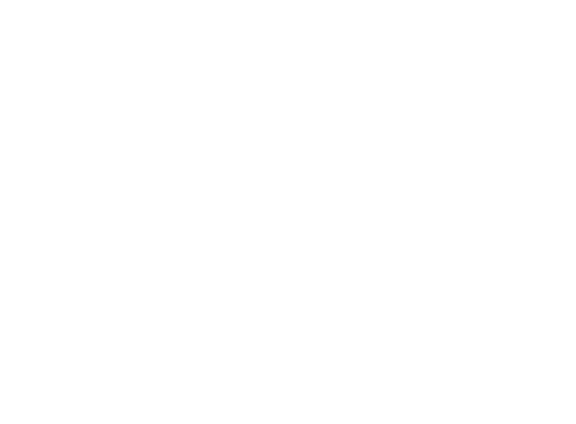

<p align="center">
  
</p>

<h1 align="center">AniFlow API</h1>

<p align="center">
  <strong>Stream Anime on Any Website — High-Performance Embedding Engine & Video Player</strong>
</p>

<p align="center">
  
  
  
  
  
</p>

<p align="center">
  <a href="#-tags-topics--search-queries"></a>
  <a href="#-tags-topics--search-queries"></a>
</p>

---

## 📖 Overview

**AniFlow API** is a complete, self-hostable anime embedding backend and modern streaming player. It enables developers to seamlessly embed high-performance anime playback directly into their websites and applications with a single iframe URL.

Designed from the ground up for speed, reliability, and visual polish, AniFlow features multi-server fallback routing, intelligent AniList/MAL identifier mapping, automatic intro/outro skipping, sub-second HLS proxying, bidirectional `postMessage` synchronization, and native mobile gesture controls with 16:9 fullscreen locking.

---

## ✨ Features

- **Multi-Server Streaming Route Engine**:
  - **Flow 1**: High-throughput primary stream (Sub & Dub).
  - **Flow 2**: Backup high-speed mirror (Sub & Dub).
  - **Yuri**: Specialized anime stream extractor (Sub & Dub).
  - **Zuri**: Dedicated subbed stream source (Sub only).
- **Dual Database Mapping**: Seamless support for both **AniList** (`/embed/ani/...`) and **MyAnimeList** (`/embed/mal/...`) IDs with automated fallback resolution.
- **Liquid Glass Dark Minimalist Player**: Crafted with the unified `shad-renew` aesthetic—featuring backdrop blur capsules, true inset highlights, subtle glow markers, and zero visual clutter.
- **Mobile First & 16:9 Fullscreen**: Native mobile gestures (smart single-tap controls toggle, double-tap left/right 10s seek) and strict 16:9 landscape orientation lock on phones.
- **Auto-Skip Intro & Outro**: Native integration with the AniSkip API. Timestamps are highlighted directly on the timeline scrubber with automatic transition capabilities.
- **Complete In-Player Customization**:
  - **Server Selection**: Dedicated Sub/Dub categorical server browser.
  - **Subtitle Customizer**: Control font family (*Sans*, *Anime*, *Serif*, *Mono*), font size, subtitle color, background box, and text outline/shadow.
  - **Playback Speed**: Precision slider with presets from `0.25x` to `2.0x`.
  - **Volume Boost**: Up to `200%` digital audio boost using the Web Audio API.
  - **Quality Selector**: Auto-adaptive HLS level selection and manual resolution picking.
- **Two-Way `postMessage` API**: Stream real-time playback events (`time`, `play`, `pause`, `complete`) to the parent site and remotely control playback via commands.
- **Edge HLS Proxying**: Direct `.m3u8` fast-path streaming, header normalization, and memory caching to keep bandwidth off upstream providers.

---

## 🚀 Quick Start

### Prerequisites

- [Node.js](https://nodejs.org/) (version `18.17.0` or higher)
- `npm`, `yarn`, or `pnpm`

### Installation

1. **Clone the repository**:
   ```bash
   git clone https://github.com/realmichaelstetson/AniFlow-API.git
   cd AniFlow-API
   ```

2. **Install dependencies**:
   ```bash
   npm install
   ```

3. **Start the development server**:
   ```bash
   npm run dev
   ```

   Open [http://localhost:3000](http://localhost:3000) in your browser to view the interactive documentation and embedded preview player.

4. **Production Build**:
   ```bash
   npm run build
   npm run start
   ```

---

## 📡 Embed API Reference

### 1. Direct Embed URLs

Embed the player anywhere using standard URL patterns:

#### AniList Pattern:
```http
GET /embed/ani/{anilistId}/{episode}/{audio}?server={server}
```

#### MyAnimeList (MAL) Pattern:
```http
GET /embed/mal/{malId}/{episode}/{audio}?server={server}
```

#### URL Parameters:
| Parameter | Type | Required | Description |
| :--- | :--- | :--- | :--- |
| `anilistId` / `malId` | `number` | **Yes** | Anime identifier from AniList or MyAnimeList. |
| `episode` | `number` | **Yes** | Episode number (default: `1`). |
| `audio` | `string` | No | Audio track: `sub` (default) or `dub`. |

#### Query Parameters:
| Query Key | Values | Default | Description |
| :--- | :--- | :--- | :--- |
| `server` | `flow` \| `flow2` \| `yuri` \| `zuri` | `flow` | Specific streaming provider. (`zuri` is sub-only). |
| `startAt` / `progress` | `number` (seconds) | `0` | Start playback at $N$ seconds. |
| `autoskipIntro` | `1` \| `0` | `1` | Enable or disable automatic intro skip. |
| `autoskipOutro` | `1` \| `0` | `1` | Enable or disable automatic outro skip. |
| `parentHost` | `string` | *(auto)* | Explicit domain if parent frame strips referer headers. |

---

### 2. Session Ticket Generation API

Generate programmatic playback sessions and ticketed embed URLs via backend requests.

#### `POST /api/play`
```bash
curl -X POST https://your-domain.com/api/play \
  -H "Content-Type: application/json" \
  -d '{
    "anilistId": 16498,
    "episode": 1,
    "audio": "sub",
    "server": "flow",
    "startAt": 120
  }'
```

#### JSON Response:
```json
{
  "success": true,
  "ticket": "9f8a3d1b-...",
  "embedUrl": "https://your-domain.com/embed?t=9f8a3d1b-...&progress=120"
}
```

---

## 💻 Code Examples

### 1. Responsive HTML Iframe

```html
<div style="position: relative; padding-bottom: 56.25%; height: 0; overflow: hidden; border-radius: 16px;">
  <iframe
    src="https://your-domain.com/embed/ani/16498/1/sub?server=flow"
    style="position: absolute; top: 0; left: 0; width: 100%; height: 100%; border: 0;"
    allowfullscreen
    allow="autoplay; fullscreen; picture-in-picture"
  ></iframe>
</div>
```

---

### 2. React / Next.js Component

```tsx
import React from "react";

interface AnimePlayerProps {
  anilistId: number;
  episode?: number;
  audio?: "sub" | "dub";
  server?: "flow" | "flow2" | "yuri" | "zuri";
}

export function AnimePlayer({
  anilistId,
  episode = 1,
  audio = "sub",
  server = "flow",
}: AnimePlayerProps) {
  const embedUrl = `https://your-domain.com/embed/ani/${anilistId}/${episode}/${audio}?server=${server}`;

  return (
    <div className="relative aspect-video w-full rounded-2xl overflow-hidden bg-black shadow-2xl">
      <iframe
        src={embedUrl}
        className="w-full h-full border-0"
        allow="autoplay; fullscreen; picture-in-picture"
        allowFullScreen
      />
    </div>
  );
}
```

---

### 3. Parent Window postMessage Integration

#### Listen for Playback Events:
```javascript
window.addEventListener("message", (event) => {
  const data = event.data;
  if (!data) return;

  // Real-time structured player events
  if (data.type === "PLAYER_EVENT") {
    console.log("Player State Changed:", data.data);
    // data.data: { type: "time"|"play"|"pause"|"complete"|"error", currentTime, duration }
  }

  // Periodic watch progress (every ~1s)
  if (data.type === "watching-log") {
    console.log("Watch Progress:", data.currentTime, "/", data.duration);
  }
});
```

#### Remote Control the Player:
```javascript
const iframe = document.getElementById("aniflow-player");

// Play / Pause
iframe.contentWindow.postMessage({ command: "play" }, "*");
iframe.contentWindow.postMessage({ command: "pause" }, "*");

// Seek to 90 seconds
iframe.contentWindow.postMessage({ command: "seek", time: 90 }, "*");

// Query current playback status
iframe.contentWindow.postMessage({ command: "getStatus" }, "*");
```

---

## 📁 Project Structure

```
aniflow-api/
├── app/
│   ├── api/
│   │   ├── anime/skip-times/    # AniSkip proxy endpoint
│   │   ├── play/                # Stream resolution & ticket API
│   │   ├── progress/            # Watch time tracker endpoint
│   │   └── proxy/               # Edge HLS proxy (m3u8, ts segments, keys)
│   ├── embed/
│   │   ├── ani/[anilistId]/     # Dynamic AniList embed routes
│   │   └── mal/[malId]/         # Dynamic MAL embed routes
│   ├── globals.css              # Global styles & theme definitions
│   ├── layout.tsx               # Root layout & site metadata
│   └── page.tsx                 # Documentation & interactive player hero
├── components/
│   └── player/
│       ├── embed-player.tsx     # Full-featured HLS streaming player
│       └── embed-page-client.tsx# Standalone embed viewport wrapper
├── lib/
│   ├── aniembed-extractor.ts    # Yuri & Zuri stream extraction engine
│   ├── reanime.ts               # Flow 1 & Flow 2 extraction engine
│   ├── skip-times.ts            # AniSkip client integration
│   └── utils.ts                 # Utility & styling helper functions
├── public/
│   ├── favicon.svg              # Vector aniflow favicon
│   ├── logo.svg                 # Vector aniflow brand logo
│   └── icons/                   # App & touch icons
├── package.json
└── tailwind.config.ts           # Design system & color tokens
```

---

## ⚡ Deployment

### Deploy with Docker

```dockerfile
FROM node:18-alpine AS runner
WORKDIR /app
ENV NODE_ENV=production
COPY package*.json ./
RUN npm ci --only=production
COPY . .
RUN npm run build
EXPOSE 3000
CMD ["npm", "start"]
```

Build and run:
```bash
docker build -t aniflow-api .
docker run -p 3000:3000 aniflow-api
```

---

## ⚖️ Legal & DMCA Disclaimer

AniFlow API is an open-source stream aggregator and playback client designed solely for educational and integration purposes. AniFlow **does not host, store, or upload** any video files or copyrighted media on its servers. All video streams and metadata are resolved dynamically from publicly available, third-party internet endpoints. 

Any copyright claims or DMCA requests should be directed to the respective upstream media hosts.


---

## 📄 License

This project is licensed under the [MIT License](LICENSE).
